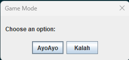

# Project Title

Simulate a game of Mancala using traditional Kalah rules, this time with a GUI!!

## Description

This Online Game of Mancala uses Object Oriented Programming to maintain readability within the code as well as 
improve maintainability. This is a fun game for 2 players to go head to head in!

## Getting Started

### Dependencies

Must have a JavaJDK installed to compile program. 

That said, if users want to build the project from scratch, modify the code, or run tests using Gradle tasks, they will need Gradle installed.

### Executing program

Firstly clone the project.
```
git clone [https://gitlab.socs.uoguelph.ca/2430F23/amoin/GP4.git]
```
Then compile the project using:
```
java -cp build/classes/java/main ui.GUI
```
Or if you want to edit the code, build with gradle and then compile as said: 
```
gradle build
gradle echo - will give executable script
java -cp build/classes/java/main ui.GUI
```
Expected output:
```
Starting Menu:


Welcome to Mancala Game!
Enter Player 1's name: 
Ashar Moin
Enter Player 2's name: 
Bill Gates 
Mancala Game Status
--------------------
Player One: Ashar Moin
Player Two: Bill Gates

Current Turn: Ashar Moin

Board Layout:
--------------------
Pit 12: 4 | Pit 11: 4 | Pit 10: 4 | Pit 09: 4 | Pit 08: 4 | Pit 07: 4 | 
Player Two Store: 0                                Player One Store: 0
Pit 01: 4 | Pit 02: 4 | Pit 03: 4 | Pit 04: 4 | Pit 05: 4 | Pit 06: 4 | 

Player 1 Move:

Player Ashar Moin's turn.
Enter your move (pit number within your boundary): 1

Mancala Game Status
--------------------
Player One: Ashar Moin
Player Two: Bill Gates

Current Turn: Bill Gates

Board Layout:
--------------------
Pit 12: 4 | Pit 11: 4 | Pit 10: 4 | Pit 09: 4 | Pit 08: 4 | Pit 07: 4 | 
Player Two Store: 0                                Player One Store: 0
Pit 01: 0 | Pit 02: 5 | Pit 03: 5 | Pit 04: 5 | Pit 05: 5 | Pit 06: 4 | 

Player 2 Move:

Player Bill Gates's turn.
Enter your move (pit number within your boundary): 12

Mancala Game Status
--------------------
Player One: Ashar Moin
Player Two: Bill Gates

Current Turn: Ashar Moin

Board Layout:
--------------------
Pit 12: 0 | Pit 11: 4 | Pit 10: 4 | Pit 09: 4 | Pit 08: 4 | Pit 07: 4 |
Player Two Store: 1                                Player One Store: 0
Pit 01: 1 | Pit 02: 6 | Pit 03: 6 | Pit 04: 5 | Pit 05: 5 | Pit 06: 4 |

Game End Message:

Player Ashar Moin's turn.
Enter your move (pit number within your boundary): 6

Mancala Game Status
--------------------
Player One: Ashar Moin
Player Two: Bill Gates

Current Turn: Bill Gates

Board Layout:
--------------------
Pit 12: 1 | Pit 11: 6 | Pit 10: 7 | Pit 09: 10 | Pit 08: 14 | Pit 07: 1 |
Player Two Store: 3                                Player One Store: 6
Pit 01: 0 | Pit 02: 0 | Pit 03: 0 | Pit 04: 0 | Pit 05: 0 | Pit 06: 0 |

Congratulations Ashar Moin! You Win!

Invalid Input: 

Player Ashar Moin's turn.
Enter your move (pit number within your boundary): 9

---------------
Invalid Move.
---------------

Mancala Game Status
--------------------
Player One: Ashar Moin
Player Two: Bill Gates

Current Turn: Ashar Moin

Board Layout:
--------------------
Pit 12: 4 | Pit 11: 4 | Pit 10: 4 | Pit 09: 4 | Pit 08: 4 | Pit 07: 4 |
Player Two Store: 0                                Player One Store: 0
Pit 01: 4 | Pit 02: 4 | Pit 03: 4 | Pit 04: 4 | Pit 05: 4 | Pit 06: 4 |

Player Ashar Moin's turn.
Enter your move (pit number within your boundary):

```
## Limitations

No limitations or features excluded from program.

## Author Information

Ashar Moin
amoin@uoguelph.ca

## Development History

Differences between AI and my code:
The Ai is able to create the code in a much less robust manner, allowing for simple code, however, my code is easier to maintain as things are spread between multiple classes. The Ai took more of a procedural approach. Besides that, the programs function the same. 

* 0.1
    * Initial Release

## Acknowledgments

* [A2Starter.zip](https://moodle.socs.uoguelph.ca/pluginfile.php/67801/mod_assign/intro/assignmentTwo.pdf)
* [Moodle Javadocs](https://moodle.socs.uoguelph.ca/pluginfile.php/67801/mod_assign/intro/javadocs.zip)
* [GPT-4 For AI Generated Version](https://chat.openai.com/)


