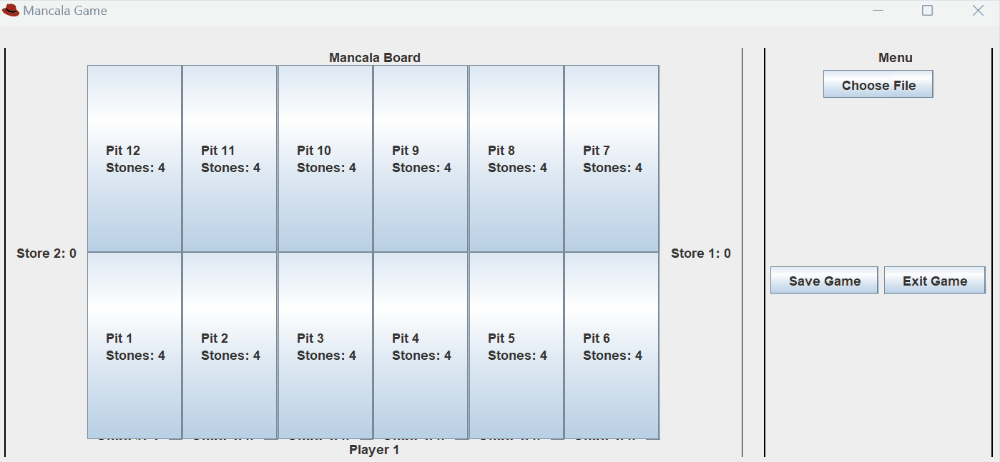

# Project Title

Simulate a game of Mancala using traditional Kalah rules, this time with a GUI!!

## Description

This Online Game of Mancala uses Object Oriented Programming to maintain readability within the code as well as 
improve maintainability. This is a fun game for 2 players to go head to head in!

## Getting Started

### Dependencies

Must have a JavaJDK installed to compile program. 

That said, if users want to build the project from scratch, modify the code, or run tests using Gradle tasks, they will need Gradle installed.

### Executing program

Firstly clone the project.
```
git clone [https://gitlab.socs.uoguelph.ca/2430F23/amoin/GP4.git]
```
Then compile the project using:
```
java -cp build/classes/java/main ui.GUI
```
Or if you want to edit the code, build with gradle and then compile as said: 
```
gradle build
gradle echo - will give executable script
java -cp build/classes/java/main ui.GUI
```
Expected output:



## Limitations

No limitations or features excluded from program.

## Author Information

Ashar Moin
amoin@uoguelph.ca

* 0.1
    * Initial Release

## Acknowledgments

* [assignmentThree.pdf](https://moodle.socs.uoguelph.ca/pluginfile.php/67802/mod_assign/introattachment/0/assignmentThree.pdf?forcedownload=1)
* [Moodle Javadocs](https://moodle.socs.uoguelph.ca/pluginfile.php/67801/mod_assign/intro/javadocs.zip)
* [GPT-4 For AI Generated Version](https://chat.openai.com/)


